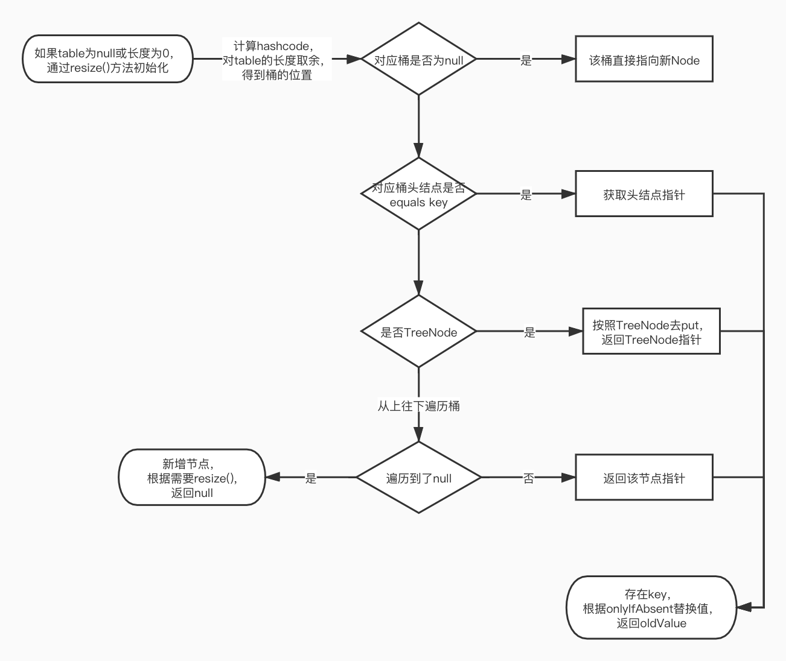

## 面试题

HashMap在什么情况下会扩容，或者有哪些操作会导致扩容？HashMap put方法的执行过程？

## 解析

当HashMap的size大于threshold时，就会触发resize()进行扩容。其中threshold=capacity*load_factor。

对应的操作包括put、merge、compute、computeIfAbsent等。

执行流程如下图：

